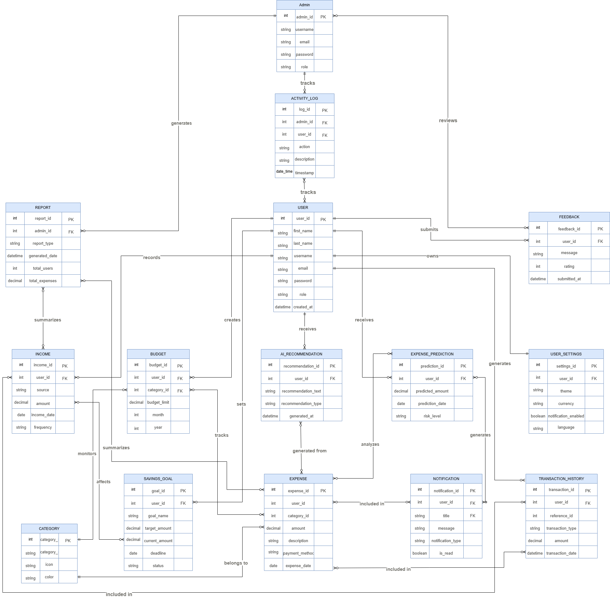
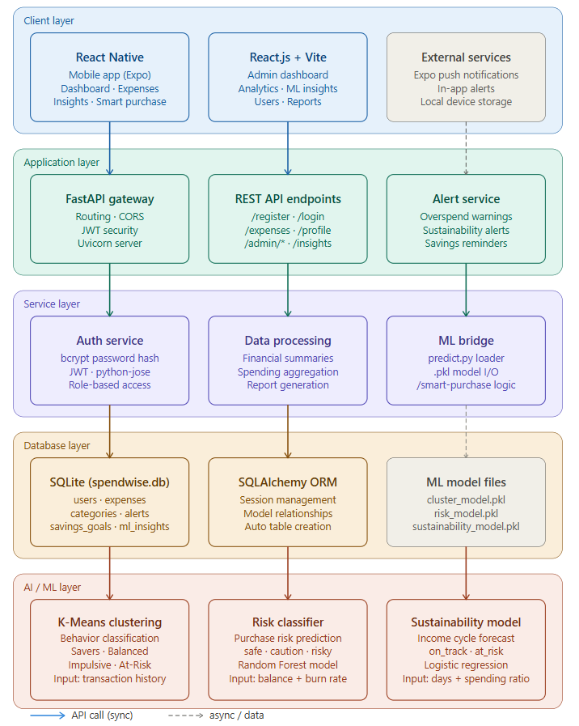

# SpendWise AI – Admin Web Dashboard

## Project Description

SpendWise AI Admin is a React single-page application that gives administrators a centralized view of the entire SpendWise platform. It connects to the FastAPI backend using admin-authenticated JWT tokens and displays aggregated user data, spending analytics, ML cluster distributions, and monthly financial reports with PDF export support.

Built with React 19 + Vite and deployed on Vercel with SPA routing configured via `vercel.json`.

## Features

- **Admin Authentication** – Dedicated login page; JWT stored in `localStorage`; protected routes redirect unauthenticated users
- **Dashboard** – Total users, total expenses, total alerts, and total savings KPI cards; 6-month spending trend chart; user cluster donut chart
- **User Management** – Full user table with cluster, risk level, income type, spending score, transaction count, and join date
- **ML Insights** – Five tabbed views:
  - Overview – aggregated ML metrics and top flagged high-risk users
  - Clusters – Saver / Balanced / Spender / Impulsive distribution
  - Patterns – category-level spending patterns
  - Budget – predicted vs. actual spending chart
  - Matrix – risk matrix visualization
- **Reports** – Monthly report table (user count, total spend, avg spend, alerts, savings, top category); PDF export via jsPDF + jspdf-autotable

## Technology Stack

| Layer | Technology |
|---|---|
| Framework | React ^19.2.0 + Vite ^7.3.1 |
| Routing | React Router DOM ^7.13.0 |
| HTTP | Fetch API (custom hooks) |
| PDF Export | jsPDF ^4.2.0 + jspdf-autotable ^5.0.7 |
| Styling | Plain CSS (per-page stylesheets in `src/styles/`) |
| Deployment | Vercel (SPA rewrites via `vercel.json`) |

## Entity Relationship Diagram



## System Architecture
```
src/
├── pages/
│   ├── AdminLogin.jsx
│   ├── Dashboard.jsx
│   ├── Users.jsx
│   ├── MLInsights.jsx
│   └── Reports.jsx
├── components/
│   ├── layout/     – AdminLayout, Sidebar, Header
│   ├── dashboard/  – MetricsGrid, SpendingChart, DonutChart, AlertsPanel
│   ├── mlinsights/ – OverviewTab, ClustersTab, PatternsTab, BudgetTab, MatrixTab
│   └── ui/         – Button, Badge, Input
├── hooks/          – useDashboard, useUsers, usemlinsight, useLogin, useNavigateTo
├── routes/         – AppRoutes.jsx
├── styles/         – dashboard.css, layout.css, users.css, mlinsights.css, reports.css, forms.css
└── config.js       – BASE_URL (reads VITE_API_URL), token helpers (getToken, setToken, clearToken)
```



All API calls target `/admin/*` endpoints on the FastAPI backend with `Authorization: Bearer <token>`.

## Installation & Setup

**Prerequisites:** Node.js 18+

```bash
git clone https://github.com/swtiekk/spendwise-ai-admin.git
cd spendwise-ai-admin

npm install
```

Create a `.env` file in the project root:
```
VITE_API_URL=http://<your-fastapi-host>:8000
```

> If no `.env` is provided, the app defaults to the IP address set in `src/config.js`.

```bash
npm run dev
# Open http://localhost:5173
```

**Production build:**
```bash
npm run build
npm run preview
```

## Test Account

| Field | Value |
|---|---|
| Username | admin |
| Password | admin123 |

> The account must have `is_admin = True` in the backend database.

## Team Members and Roles

Sotie Katrina Golez  
Florie Jayne Soler  
Trisha Araquil  
Steve Drylle Sarino  

## Known Limitations

- `VITE_API_URL` must be set correctly in Vercel environment variables for the deployed version to reach the backend
- Charts are custom CSS implementations with limited interactivity (no third-party chart library used)
- No pagination on the Users table; performance may degrade with large user counts
- `localStorage` is used for token storage, which is acceptable for an admin tool but should be reviewed for stricter security requirements

## Screenshots


